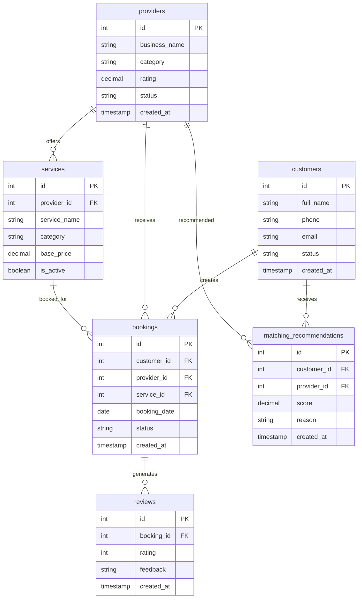

# Entity Relationship Diagram

    ev_battery_snapshots {
        int id PK
        int vehicle_id FK
        int battery_health
        int charging_cycles
        int battery_temperature
        int estimated_range_km
        string risk_level
    }

    driver_behavior_events {
        int id PK
        int vehicle_id FK
        int hard_brakes
        int rapid_accelerations
        int overspeed_events
        int driver_score
        string behavior_classification
    }

    hybrid_efficiency_snapshots {
        int id PK
        int vehicle_id FK
        decimal fuel_consumption_l_100km
        int electric_range_km
        int battery_usage_percent
        int efficiency_score
        string classification
    }

    vehicle_valuations {
        int id PK
        int vehicle_id FK
        decimal original_price
        decimal estimated_value
        string classification
    }

    insurance_risk_profiles {
        int id PK
        int vehicle_id FK
        int driver_score
        int active_fault_codes
        int accident_count
        int insurance_risk_score
        decimal premium_multiplier
    }

    vehicles ||--o{ ev_battery_snapshots : generates
    vehicles ||--o{ driver_behavior_events : generates
    vehicles ||--o{ hybrid_efficiency_snapshots : generates
    vehicles ||--o{ vehicle_valuations : generates
    vehicles ||--o{ insurance_risk_profiles : generates
