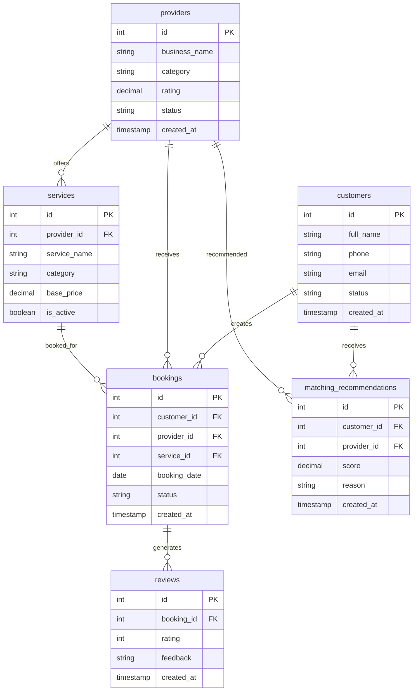

# Entity Relationship Diagram

```mermaid
erDiagram

    customers {
        int id PK
        string full_name
        string phone
        string email
        string status
        timestamp created_at
    }

    providers {
        int id PK
        string business_name
        string category
        decimal rating
        string status
        timestamp created_at
    }

    services {
        int id PK
        int provider_id FK
        string service_name
        string category
        decimal base_price
        boolean is_active
    }

    bookings {
        int id PK
        int customer_id FK
        int provider_id FK
        int service_id FK
        date booking_date
        string status
        timestamp created_at
    }

    reviews {
        int id PK
        int booking_id FK
        int rating
        string feedback
        timestamp created_at
    }

    matching_recommendations {
        int id PK
        int customer_id FK
        int provider_id FK
        decimal score
        string reason
        timestamp created_at
    }

    providers ||--o{ services : offers
    customers ||--o{ bookings : creates
    providers ||--o{ bookings : receives
    services ||--o{ bookings : booked_for
    bookings ||--o{ reviews : generates
    customers ||--o{ matching_recommendations : receives
    providers ||--o{ matching_recommendations : recommended
```
